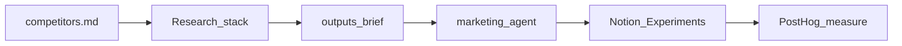

# Competitor intel → growth experiments

Canonical plan for this repo (open while the `gostylens-harness` workspace is active).

## Goal

Maintain a living competitor list, run structured public research, and convert signals into **acquisition experiment ideas** in Notion — not a parallel strategy backlog in git.

Internal data (PostHog, Meta, ASC) shows *where we leak*. Competitor intel suggests *what channels, hooks, and packaging* to test.

## Non-goals

- No scraping, fake accounts, or paid competitive-intel tools in v1
- No parallel experiment backlog in git (Notion remains source of truth)
- No auto-posting / ops execution (`stylens-ops` stays separate)
- Competitors inform *what to test*; our metrics decide *whether it worked*

## Architecture



| Layer | Role |
|-------|------|
| `context/marketing/competitors.md` | Who we watch (source of truth for the list) |
| Research stack | perplexity-search → WebSearch/WebFetch → Browser (deep dive) |
| `outputs/YYYY-MM-DD-competitor-brief.md` | Dated research artifact |
| `agents/marketing.md` | Synthesize → experiment candidates |
| Notion Experiments | Canonical `idea` → `planned` → `running` → `post-decision` |
| Growth analyst (light) | Confirm PostHog can measure before `planned`/`running` |

## Locked defaults

- **List storage:** markdown in harness (`competitors.md`) for v1 — git history, Cursor-native. Notion DB only if non-Cursor editing becomes needed.
- **Research stack:** prefer `perplexity-search` → Cursor WebSearch/WebFetch on failure → Browser MCP for LP/ASO/paywall deep dives. Not coding MCP.
- **Experiment handoff:** Notion MCP + existing template (`context/experiments.md`); default `Domain(s)` = `User Acquisition`.
- **Filter:** every idea must fit ICP + `positioning.md` and map to an exact event from `analytics-events.md`.

## Phase 1 — Context scaffold

### 1. `context/marketing/competitors.md`

Table columns:

| Field | Purpose |
|-------|---------|
| Name | Competitor / alternative |
| Type | `direct` · `adjacent` · `aspirational` |
| Links | App Store, site, TikTok/IG, Product Hunt |
| ICP overlap | High / med / low + one line why |
| Watch focus | e.g. ASO, TikTok creative, paywall, community |
| Last reviewed | Date |
| Notes | Short durable notes (not a full brief) |

Seed 5–8 rows (placeholders OK until user fills names).

### 2. `context/marketing/positioning.md`

Keep short “alternatives” bullets; link Differentiation / Competitors to `competitors.md` as the detailed list.

### 3. `agents/marketing.md`

Add task template **Competitor scan → experiments**:

1. Read `competitors.md` + `positioning.md`
2. Research via perplexity-search → WebSearch/WebFetch fallback → Browser deep dive
3. Write dated brief under `outputs/`
4. Propose 2–3 experiments; dedupe Notion; create `idea` rows with template_id

### 4. `README.md`

One-line mention under marketing context layout.

## Phase 2 — Brief format

Save as `outputs/YYYY-MM-DD-competitor-brief.md` (or per-competitor for deep dives):

```markdown
# Competitor brief — {Name} — YYYY-MM-DD

## Snapshot
Type, ICP overlap, one-line positioning vs GoStylens

## Acquisition signals
Channels, creative hooks, ASO themes, LP claims, social proof

## Monetization / conversion signals
Pricing, trial, paywall timing, freemium (public only)

## Product surface (marketing-visible)
Onboarding claims, advertised core loop, pushed differentiators

## What’s transferable
≤3 bullets — adapted to GoStylens

## What’s not transferable
ICP / brand / unmeasurable mismatches

## Experiment candidates
hypothesis · channel · effort S/M/L · primary PostHog metric
```

Agent rules:

- Label **observation** vs **inference**
- Prefer recent sources; note date uncertainty
- Never invent metrics — only events from `analytics-events.md`
- On perplexity-search failure: report Failed and continue with WebSearch/WebFetch

## Phase 3 — Synthesis → Notion

For each transferable signal:

1. Search Notion Experiments for duplicates
2. Create row with `template_id` `3cf3d958-f999-807b-9697-c7e052f6192f`
3. Properties: `Domain(s)=User Acquisition`, Priority P1/P2
4. Fill Goal / Hypothesis / Primary metric / Channel & effort / Execution plan
5. Link brief path under Assets / links

Growth analyst: confirm measurability before promoting past `idea`.

## Phase 4 — Cadence (manual first)

| Cadence | Action |
|---------|--------|
| Ad hoc | “Research competitor X” → brief → experiments |
| Monthly | Re-scan watchlist; update Last reviewed; ≤5 new ideas |
| After experiment closes | Revisit related competitor notes |

Optional later: Cursor Automation for monthly scan — only after the manual loop proves useful. Document in `automations/README.md` then. No `stylens-ops` involvement.

## Implementation order

1. Scaffold `competitors.md` + positioning link + marketing agent + README
2. User seeds real competitor names/links
3. First research pass: 2–3 directs → briefs
4. Create Notion idea rows
5. (Later) monthly automation doc

Effort: scaffold **S**; first research pass is the real work.

## Open choices (resolve during seed)

- **Seed list:** user provides named directs vs discovery pass then lock list
- **Depth vs breadth:** deep brief on 2 first vs shallow scan of 8 — recommend deep on 2–3 directs for first run
