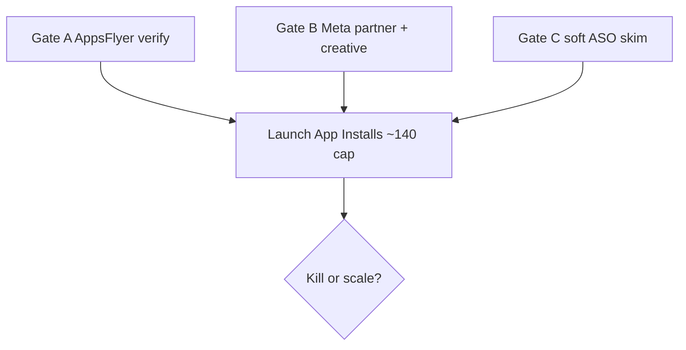

# Meta App Installs smoke (post-ASO + AppsFlyer)

Canonical plan for this experiment in `gostylens-harness`. Notion remains the experiment source of truth; this file is the executable checklist for Cursor.

**Notion:** [Meta Ads — App Installs smoke](https://app.notion.com/p/3ee3d958f99981e28d98fbfebd2eceb4) · Status **planned** (2026-10-05)

## Goal

Buy **quality US iOS installs** that become new users — measurable with AppsFlyer + PostHog — after the store listing converts better than the killed Traffic smoke test.

## Hypothesis

If we run a time-boxed Meta **App Installs** campaign (not Traffic, not purchase Conversions) after (1) ASO is not clearly broken and (2) AppsFlyer is verified in TestFlight (`install` + `af_complete_registration` + `af_activation`), then we get attributed US installs and new `auth_succeeded` (`is_new_user=true`) at Meta CPI ≤ $12 — interest already worked (CTR ~2.6%); prior failure was store → install; we now have MMP attribution.

## Metrics & kill/scale

| Layer | Metric |
|-------|--------|
| Primary (PostHog) | `auth_succeeded` with `is_new_user=true` (US iOS) during flight + 7d |
| Secondary (PostHog) | `ai_stream_completed` |
| Meta / AppsFlyer | install CPI, attributed installs, `af_complete_registration`, `af_activation` |

**Kill:** Meta CPI > $12 after ≥ $60 spent, **or** 0 new `auth_succeeded` after ≥ 15 attributed installs (or day 7).

**Scale:** only if CPI ≤ $7 **and** activation non-zero.

## Non-goals / hard rules

- Do **not** spend until Gate A + Gate B are checked
- Objective is **App installs** → iOS App Store — not Traffic, not purchase Conversions
- Debug builds do **not** send AppsFlyer — use TestFlight/release on a real iPhone
- `af_complete_registration` fires on **new profile create** (full onboarding), not returning login
- ASO is a **soft** gate: if US page views still ~0, keep this a tiny smoke (do not scale)

## Flow

## Gate A — AppsFlyer (required before spend)

- [x] Production env has `APPSFLYER_DEV_KEY` + `APPSFLYER_IOS_APP_ID` (numeric `6760427902`)
- [x] TestFlight/release build on a real iPhone
- [x] AppsFlyer SDK Integration Test shows **Launch** (install)
- [x] New account through onboarding → **`af_complete_registration`**
- [x] Styling reply completes → **`af_activation`**
- [ ] (Optional) sandbox purchase via RevenueCat → AppsFlyer once
- [ ] (Optional) deny ATT once; SKAN install still arrives later

Reference: `stylens/.cursor/plans/appsflyer-attribution.plan.md` (sibling app repo)

## Gate B — Meta + AppsFlyer partner (setup now)

- [x] AppsFlyer → Active integrations → enable **Meta / Facebook**
- [x] Postbacks: install, `af_complete_registration`, `af_activation` (confirm if not already)
- [ ] Copy AppsFlyer click + impression links for Meta
- [ ] Meta Events Manager / app linked for **App installs** (iOS App Store ID `6760427902`)
- [ ] Creative: reuse/improve `outputs/creative/gostylens_initial_test_launch_v2.mp4` (Reels + Stories)

## Gate C — Soft ASO (do not block prep)

- [ ] Skim Notion ASO experiment / ASC — if US page views still ~0, stay tiny smoke only
- [ ] Live listing title/subtitle match the ad promise

## Launch (only after Gate A + B)

1. Objective: **App installs** → iOS App Store URL
2. Audience: US, age ~22–35, fashion interest stack
3. Placements: Instagram **Reels + Stories**
4. Budget: **~$20/day × 7 days** (~**$140** hard cap); no mid-flight edits unless tracking broken
5. Notion: Status → `running`, set Started date; paste Meta Ads Manager URL under Assets

## Close (day 7 or kill rule)

1. Meta + AppsFlyer: spend, CPI, attributed installs, registration, activation
2. PostHog US iOS: `auth_succeeded` (`is_new_user=true`) + `ai_stream_completed` vs prior 7d
3. Apply kill/scale; Notion Status → `post-decision`; fill Result + Decision notes

## Assets

| Asset | Path / link |
|-------|-------------|
| Notion experiment | https://app.notion.com/p/3ee3d958f99981e28d98fbfebd2eceb4 |
| Idea check | `outputs/2026-10-03-idea-check-meta-conversion-ad.md` |
| ASO pulse | `outputs/2026-10-03-aso-pulse.md` |
| Killed Traffic test | Notion `3d13d958-f999-8126-9dcb-c1427f16fa1f` |
| Soft-gate ASO | Notion `3e53d958-f999-815a-8026-e4086337228c` |
| App Store | https://apps.apple.com/us/app/gostylens/id6760427902 |
| Creative | `outputs/creative/gostylens_initial_test_launch_v2.mp4` |

## Dates

Planned: 2026-10-05 · Started: **2026-10-06** · Scheduled end: **2026-10-12** · Ended: —
